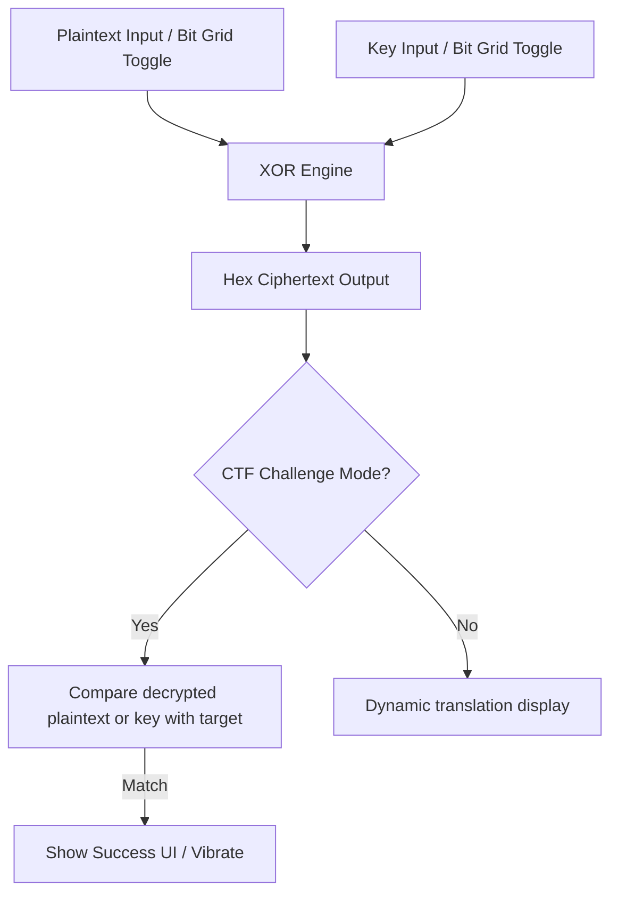

# Technical Design: Cipher XOR Lab

This document details the design and implementation details for the Repeating-Key XOR laboratory component featuring a bit-toggle interactive grid.

## 1. Architectural Decisions

| Decision | Choice | Rationale |
|---|---|---|
| **Component Tech** | Astro + Vanilla JS `<script>` | Fits existing stack, runs entirely client-side without heavy frameworks, matching low footprint. |
| **Data Encoding** | Hexadecimal for Ciphertext, UTF-8 for Plaintext/Key | XORing generates arbitrary bytes; Hex representation prevents layout breaks or copy-paste issues. |
| **Grid Interaction** | 8-bit clickable grid per key byte | Tactile visual aid helps students connect character representation with bitwise operations. |
| **CTF Validation** | Client-side comparison | Simplifies deployment, fits offline-first, static-hosting requirements of `raíz_`. |

## 2. Schema Configuration

Modify `/home/jojan/AppsWebs/ciberapp/app/src/content.config.ts` to include optional configuration parameters under the `lab` object:

```typescript
// app/src/content.config.ts
lab: z.object({
  tipo: z.enum(['toggle', 'terminal_sim', 'cipher_xor', 'subnetting', 'packet_visualizer', 'none']).default('none'),
  descripcion: z.string().optional(),
  texto_plano: z.string().optional(),
  clave: z.string().optional(),
  cifrado: z.string().optional(),
}).default({ tipo: 'none' }),
```

## 3. Data Flow



## 4. Component Interface & Props

The component `app/src/components/CipherXor.astro` accepts the following props:

*   `descripcion`: Instruction text for the lab (optional).
*   `textoPlano`: Default plaintext or target decrypted plaintext for CTF mode (optional).
*   `clave`: Default key or correct decryption key for CTF mode (optional).
*   `cifrado`: Default hex ciphertext or target ciphertext for CTF mode (optional).

If `cifrado` and `clave` are provided, the component operates in **CTF Mode**.

## 5. Implementation Details

### 5.1 HTML/Astro Structure
The UI adopts the brutalist minimalist styling of the application:
*   Two main textareas/inputs: Text/Plaintext, Key (ASCII), and Ciphertext (Hex).
*   A container representing the key bytes with 8 checkbox-like cells per byte.
*   A success indicator box styled with a green border and text for validation feedback.

### 5.2 Client-Side JavaScript Logic

```javascript
// Byte and string conversion utilities
const toBytes = (str) => new TextEncoder().encode(str);
const fromBytes = (bytes) => new TextDecoder().decode(bytes);
const toHex = (bytes) => Array.from(bytes).map(b => b.toString(16).padStart(2, '0')).join('');
const fromHex = (hex) => {
  const cleanHex = hex.replace(/[^0-9a-fA-F]/g, '');
  const bytes = new Uint8Array(cleanHex.length / 2);
  for (let i = 0; i < bytes.length; i++) {
    bytes[i] = parseInt(cleanHex.substr(i * 2, 2), 16);
  }
  return bytes;
};

// Repeating-key XOR execution
const xor = (data, key) => {
  if (key.length === 0) return data;
  const out = new Uint8Array(data.length);
  for (let i = 0; i < data.length; i++) {
    out[i] = data[i] ^ key[i % key.length];
  }
  return out;
};
```

### 5.3 Bit Toggling Grid UI
*   Displays the binary structure of the key.
*   Each row represents one character/byte of the key.
*   Contains 8 blocks (bits from MSB to LSB). Clicking flips the bit, recalculates the ASCII character value, updates the Key text input, and triggers the XOR update cycle.
*   Uses standard flex layout for responsiveness (`flex-wrap: wrap`), with overflow safety on small screens.

### 5.4 Integration Point

In `/home/jojan/AppsWebs/ciberapp/app/src/pages/l/[leccion].astro`:

```astro
{leccion?.data?.lab?.tipo === 'cipher_xor' && (
  <CipherXor 
    descripcion={leccion.data.lab.descripcion}
    textoPlano={leccion.data.lab.texto_plano}
    clave={leccion.data.lab.clave}
    cifrado={leccion.data.lab.cifrado}
  />
)}
```

## 6. Testing Strategy

1.  **Unit Tests**: Verify `xor` works with varying lengths of data/keys (empty key, key longer than data).
2.  **Functional Checks**: Toggle a bit in the grid and confirm the text key representation updates immediately.
3.  **Validation Check**: Input incorrect decryption key in CTF mode → success UI remains hidden; input correct key → success UI appears.

## 7. Rollout Plan
1.  Extend schema configuration in `content.config.ts`.
2.  Create `CipherXor.astro` with HTML, CSS, and interactive script.
3.  Register and import the component inside `[leccion].astro`.
4.  Add a test lesson containing a `cipher_xor` lab to check styling, responsiveness, and responsiveness of the grid on mobile.
